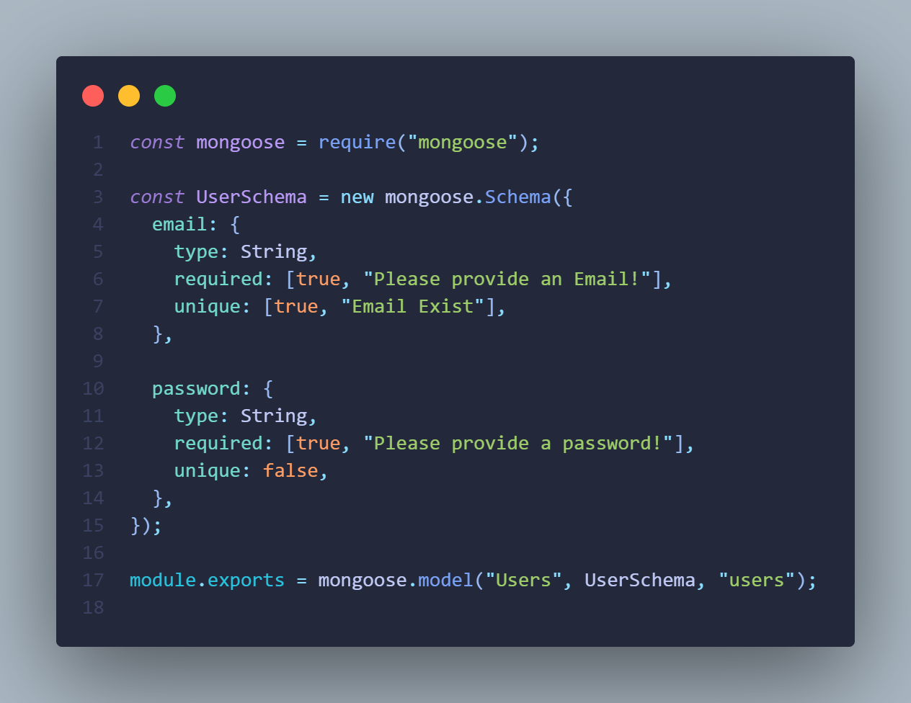

# Auth Backend MongoDB

## About the Project

The "Auth Backend MongoDB" project is a backend server built using Node.js and MongoDB that focuses on implementing user registration and login functionality. It serves as a learning tool to understand the process of user authentication and management in a web application. By exploring this project, developers can gain insights into the concepts and techniques involved in building secure and scalable authentication systems.

## Features

- User registration: Allows users to create new accounts by providing their credentials and securely storing them in the MongoDB database.
- User login: Enables users to authenticate themselves by providing their registered email and password, allowing them to access protected resources.
- JSON Web Tokens (JWT): Implements JWT-based authentication to securely handle user sessions and authorize access to protected routes.
- Password encryption: Uses industry-standard encryption techniques, such as bcrypt, to securely store and compare user passwords.
- Error handling: Implements robust error handling mechanisms to provide informative and user-friendly error messages.

## Installation

To run the "Auth Backend MongoDB" project locally, follow these steps:

1. Clone the repository: `git clone git@github.com:Pixeloceax/auth-backend-mongo.git`
2. Install the dependencies: `npm install`
3. Set up the environment variables by creating a `.env` file and providing the necessary configurations.
4. Start the server: `node app.js`
5. The server will be running on `http://localhost:3000`.

Make sure you have a running instance of MongoDB or configure the connection settings in the environment variables.

## Usage

To test the user registration and login functionality, you can use API testing tools like Postman or cURL. Here are some example requests:

- User Registration:

  - Method: POST
  - Endpoint: `http://localhost:3000/register`
  - Request Body: `{ "email": "example@example.com", "password": "password123" }`

- User Login:
  - Method: POST
  - Endpoint: `http://localhost:3000/login`
  - Request Body: `{ "email": "example@example.com", "password": "password123" }`

## Learning Goals

The main objective of the "Auth Backend MongoDB" project is to provide a practical learning experience for developers who want to understand how user registration and login systems work in a Node.js and MongoDB environment. By studying this project, developers can grasp the following concepts:

- Setting up a Node.js server with Express.js.
- Connecting to a MongoDB database using a MongoDB driver.
- Implementing user registration and login routes.
- Working with JSON Web Tokens (JWT) for authentication and session management.
- Securely storing and comparing user passwords using bcrypt.

## Next Steps

While the "Auth Backend MongoDB" project focuses on the fundamental aspects of user registration and login, there are several areas where you can expand and enhance the functionality, such as:

- Adding email verification for user registration.
- Implementing password reset functionality.
- Integrating third-party authentication providers (e.g., OAuth, Google, Facebook).
- Implementing role-based access control (RBAC) for different user roles.
